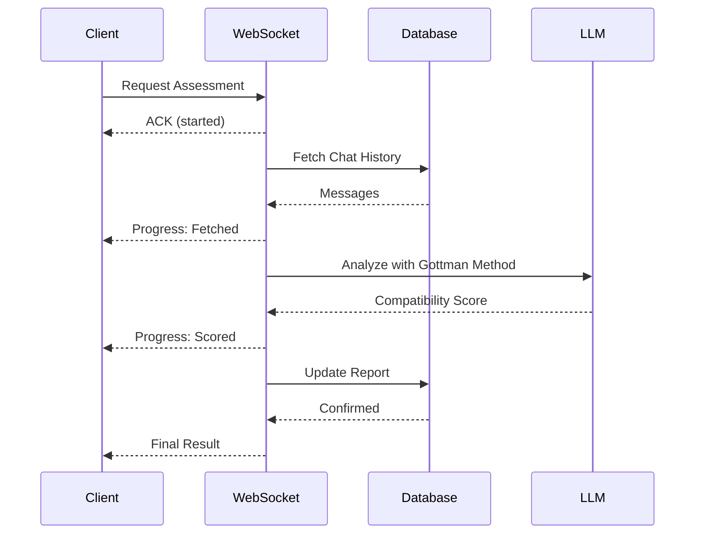

# JanamSaathi AI

<div align="center">


**Finding your life partner using AI — in weeks, not months**

[](https://opensource.org/licenses/MIT)
[](https://fastapi.tiangolo.com)
[](https://www.python.org)
[](https://flutter.dev)
[](https://github.com/facebookresearch/faiss)
[](https://redis.io)
[](https://www.postgresql.org)
[](https://www.researchgate.net/publication/363693134_Retrieval-Augmented_Generation)

**[Watch Full Demo →](https://www.youtube.com/watch?v=naVaP0DdNx4)**

</div>

---

## The Problem

Indian arranged marriage timelines are broken by design:

- Parents shortlist → horoscope checks → family meetings → **1–2 months gone**
- Boy and girl finally meet → compatibility evaluation → **another 3–4 months**
- Dating apps offer speed, but shallow profiles ("foodie", "wanderlust") and authenticity issues make them a poor fit for serious relationships

**JanamSaathi AI compresses this 6+ month process into weeks** by replacing manual compatibility guesswork with semantic AI analysis, Gottman Method relationship science, and real-time communication — all in a single full-stack platform.

---

## Architecture & Demo

### System Architecture
<p align="center">
  
</p>

### Live Demo
<p align="center">
  
</p>

### Low-Level Design
<div align="center">
  
</div>

---

## Table of Contents

- [Features](#-features)
- [Technology Stack](#-technology-stack)
- [Key Technical Implementations](#-key-technical-implementations)
- [Prerequisites](#-prerequisites)
- [Installation](#-installation)
- [Configuration](#-configuration)
- [Running the Application](#-running-the-application)
- [Project Structure](#-project-structure)
- [API Documentation](#-api-documentation)
- [License](#-license)

---

## ✨ Features

### 🔐 User Management
- Secure signup/login with JWT authentication (access + refresh tokens)
- Comprehensive profile creation covering cultural practices, lifestyle, and family values
- Photo upload with multipart form-data support
- Token auto-refresh mechanism

### 🤖 AI-Powered Matchmaking
- **Semantic similarity search** using FAISS vector database
- **384-dimension embeddings** via SentenceTransformer (`all-MiniLM-L6-v2`)
- Preference-based filtering across gender, religion, caste, and lifestyle
- Real-time top-K recommendations (configurable, default K=5)

### 💬 Real-Time Chat
- **WebSocket-based messaging** with sub-100ms latency
- **Optimistic UI updates** — instant local rendering before server acknowledgement
- **Redis write-behind caching** with bulk DB flush on disconnect (~90% reduction in DB write operations)
- Automatic reconnection with exponential backoff
- Message deduplication and ordering guarantees

### 📊 Compatibility Assessment
- **Gottman Method analysis** across 7 relationship principles:
  - Positive vs. negative interaction ratio (5:1 healthy threshold)
  - Emotional intimacy indicators
  - Conflict resolution patterns
  - Shared life goals alignment
- **LLM-powered sentiment scoring** via OpenRouter API
- **Incremental averaging** for multi-topic assessments without storing raw score history
- **Streaming progress updates** via WebSocket during analysis

### 🌟 Horoscope Matching
- Vedic astrology compatibility calculation
- Birth chart analysis from DOB and place of birth
- LLM-based horoscope score generation
- Combined traditional + modern compatibility scoring

### 📈 Reports & Analytics
- Unified compatibility reports combining AI and horoscope scores
- Historical assessment tracking across conversation topics
- Deduplication via ordered pair indexing (no duplicate reports for A↔B)

---

## 🛠️ Technology Stack

### Frontend
| Technology | Version | Purpose |
|-----------|---------|---------|
| Flutter | 3.19+ | Cross-platform mobile/web UI |
| Dart | 3.5+ | Programming language |
| WebSocket Channel | 2.4.0 | Real-time communication |
| HTTP | 1.2.1 | REST API calls |
| SharedPreferences | 2.2.2 | Local token storage |
| UUID | 4.5.1 | Request ID correlation |

### Backend
| Technology | Version | Purpose |
|-----------|---------|---------|
| FastAPI | 0.115.0 | Async web framework |
| Python | 3.11+ | Programming language |
| PostgreSQL | 14+ | Relational database |
| Redis | 7.0+ | Message cache & pub/sub |
| SQLAlchemy | 2.0.29 | ORM |
| PyJWT | 2.9.0 | Token authentication |

### AI/ML
| Technology | Version | Purpose |
|-----------|---------|---------|
| FAISS | 1.7.4 | Vector similarity search |
| SentenceTransformers | 2.6.1 | Text embeddings |
| OpenAI SDK | 1.14.0 | LLM integration via OpenRouter |
| NumPy | 1.26.4 | Numerical operations |

---

## 🔑 Key Technical Implementations

### 1. Ordered Pair Pattern — Database Deduplication

**Problem:** A compatibility report for (Alice, Bob) must be the same record as (Bob, Alice) — not two separate rows.

**Solution:**
```python
def ordered_pair(user1_id, user2_id):
    return (min(int(user1_id), int(user2_id)),
            max(int(user1_id), int(user2_id)))

# Always store as (min, max) regardless of query direction
u1, u2 = ordered_pair(alice_id, bob_id)
report = Report(user1_id=u1, user2_id=u2, ...)
```

**Database Index:**
```sql
CREATE UNIQUE INDEX ix_report ON report (
    LEAST(user1_id, user2_id),
    GREATEST(user1_id, user2_id)
);
```

Zero duplicate reports, efficient lookups regardless of query direction.

---

### 2. Redis Write-Behind Caching

**Problem:** High-frequency chat messages hitting PostgreSQL directly would collapse under load.

**Flow:**
```python
# During active chat — write to Redis only
await redis_client.rpush(f"chat:{room_id}", json.dumps(message))

# On disconnect — bulk flush to PostgreSQL once
messages = await redis_client.lrange(f"chat:{room_id}", 0, -1)
await redis_client.delete(f"chat:{room_id}")
db.bulk_insert_mappings(ChatMessage, messages)
```

~90% reduction in DB write operations. Sub-100ms message latency. Zero message loss on disconnect.

---

### 3. Optimistic UI Updates

**Problem:** Round-trip latency makes chat feel sluggish even on fast connections.

**Flutter implementation:**
```dart
// 1. Render message immediately — before server confirmation
setState(() => messages.add({"sender": userId, "text": text}));

// 2. Send to server async
final result = await ChatSocket.sendMessageOptimistic(to: partnerId, text: text);

// 3. Handle ack or surface retry option
result.ack.then((ack) {
  // Mark as delivered ✓
}).catchError((err) {
  // Show retry button
});
```

Perceived latency = 0ms.

---

### 4. Incremental Compatibility Averaging

**Problem:** Assessing multiple conversation topics (lifestyle, future goals, family) should update a running compatibility score without storing every individual score.

**Solution:**
```python
new_sum = current_sum + new_score
new_count = current_count + 1
new_avg = new_sum / new_count

report.sentiment_sum = new_sum
report.sentiment_count = new_count
report.sentiment_avg = new_avg
```

Recalculates average in O(1) without raw score history. Preserves sum + count for future weighted averaging.

---

### 5. WebSocket Handler Registry

**Problem:** A monolithic WebSocket handler becomes unmaintainable as message types grow.

**Pattern:**
```python
# Register handlers by message type
manager.register_handler("chat", handle_chat)
manager.register_handler("assess", handle_assess)
manager.register_handler("view_report", handle_report)

# Dispatch dynamically — core logic never changes
handler = _handlers.get(msg_type)
await handler(websocket, user_id, request_id, payload, meta, ctx)
```

New message types added without touching core dispatch logic. Each handler is independently testable. Command pattern implementation.

---

### 6. Data Flow — Compatibility Assessment



---

## 📦 Prerequisites

### Frontend
- [Flutter SDK](https://flutter.dev/docs/get-started/install) 3.19+
- [Android Studio](https://developer.android.com/studio) for Android development
- [Xcode](https://developer.apple.com/xcode/) for iOS development (macOS only)

### Backend
- [Python](https://www.python.org/downloads/) 3.11+
- [PostgreSQL](https://www.postgresql.org/download/) 14+
- [Redis](https://redis.io/download) 7.0+
- [Docker](https://docs.docker.com/get-docker/) & Docker Compose (optional, recommended for production)

---

## 🚀 Installation

### 1. Clone the Repository
```bash
git clone https://github.com/Bharath-Ramamurthy/JanamSaathi-AI.git
cd JanamSaathi-AI
```

### 2. Backend Setup

```bash
cd backend
python -m venv venv

# Activate — macOS/Linux
source venv/bin/activate

# Activate — Windows
venv\Scripts\activate

pip install --upgrade pip
pip install -r requirements.txt
```

**Start PostgreSQL:**
```bash
# Ubuntu/Debian
sudo apt install postgresql postgresql-contrib
sudo systemctl start postgresql

# macOS
brew install postgresql@14
brew services start postgresql@14
```

**Create database:**
```bash
sudo -u postgres psql
CREATE DATABASE janamsaathiai_db;
CREATE USER janamsaathiai_user WITH PASSWORD 'your_secure_password';
GRANT ALL PRIVILEGES ON DATABASE janamsaathiai_db TO janamsaathiai_user;
\q
```

**Start Redis:**
```bash
# Ubuntu/Debian
sudo apt install redis-server
sudo systemctl start redis

# macOS
brew install redis && brew services start redis
```

### 3. Frontend Setup
```bash
cd frontend
flutter pub get
flutter doctor
```

**Configure API endpoint** in `lib/services/api.dart`:
```dart
} else if (Platform.isAndroid) {
    baseUrl = 'http://10.0.2.2:8000';  // Android emulator
} else {
    baseUrl = 'http://127.0.0.1:8000';  // iOS simulator / web
}
```

---

## ⚙️ Configuration

Create `backend/.env` from the template:
```bash
cp .env.example .env
```

**`.env` reference:**
```env
# Server
BACKEND_HOST=127.0.0.1
BACKEND_PORT=8000
DEBUG=True

# Database
DB_USER=janamsaathiai_user
DB_PASS=your_secure_password
DB_HOST=localhost
DB_PORT=5432
DB_NAME=janamsaathiai_db

# Redis
REDIS_HOST=localhost
REDIS_PORT=6379

# Security
JWT_SECRET=          # generate: python -c "import secrets; print(secrets.token_urlsafe(32))"
JWT_ALGORITHM=HS256
ACCESS_EXPIRE_MINUTES=15
REFRESH_EXPIRE_DAYS=30

# AI/ML
HUGGINGFACE_HUB_TOKEN=     # https://huggingface.co/settings/tokens
OPENROUTER_API_KEY=         # https://openrouter.ai/keys
LLM_MODEL=anthropic/claude-3.5-sonnet
LLM_BASE_URL=https://openrouter.ai/api/v1

# WebSocket
WS_PING_INTERVAL=30
```

**Initialize database:**
```bash
python -c "from core.database import Base, engine; Base.metadata.create_all(bind=engine)"
```

---

## ▶️ Running the Application

### Development (Manual)

**Terminal 1 — Backend:**
```bash
cd backend && source venv/bin/activate
uvicorn main:app --reload --host 0.0.0.0 --port 8000
```

Swagger UI available at `http://localhost:8000/docs`

**Terminal 2 — Frontend:**
```bash
cd frontend
flutter run -d chrome          # Web
flutter run -d <device_id>     # Android / iOS (flutter devices to list)
```

---

### Production (Docker Compose)

```yaml
# docker-compose.yml
version: '3.8'

services:
  postgres:
    image: postgres:14-alpine
    environment:
      POSTGRES_DB: janamsaathiai_db
      POSTGRES_USER: janamsaathiai_user
      POSTGRES_PASSWORD: ${DB_PASS}
    volumes:
      - postgres_data:/var/lib/postgresql/data
    healthcheck:
      test: ["CMD-SHELL", "pg_isready -U janamsaathiai_user"]
      interval: 10s
      retries: 5

  redis:
    image: redis:7-alpine
    volumes:
      - redis_data:/data
    healthcheck:
      test: ["CMD", "redis-cli", "ping"]
      interval: 10s

  backend:
    build: ./backend
    command: uvicorn main:app --host 0.0.0.0 --port 8000
    ports:
      - "8000:8000"
    env_file: ./backend/.env
    environment:
      DB_HOST: postgres
      REDIS_HOST: redis
    depends_on:
      postgres:
        condition: service_healthy
      redis:
        condition: service_healthy

volumes:
  postgres_data:
  redis_data:
```

```bash
docker-compose up -d
docker-compose logs -f backend
```

---

## 📁 Project Structure

```
JanamSaathi-AI/
│
├── backend/
│   ├── core/
│   │   ├── config.py            # Pydantic settings
│   │   ├── database.py          # SQLAlchemy + connection pooling
│   │   ├── security.py          # JWT & password hashing
│   │   └── redis.py             # Redis client
│   │
│   ├── models/                  # SQLAlchemy ORM models
│   │   ├── user.py
│   │   ├── chat.py
│   │   └── report.py
│   │
│   ├── schemas/                 # Pydantic request/response schemas
│   │   ├── user.py
│   │   ├── chat.py
│   │   ├── report.py
│   │   ├── horoscope.py
│   │   └── match.py
│   │
│   ├── routes/
│   │   ├── deps.py              # Dependency injection
│   │   ├── auth.py              # /auth/* endpoints
│   │   ├── rag_faiss.py         # /recommend (matchmaking)
│   │   ├── conversations.py     # /fetch_conversations
│   │   └── socket_connection.py # /ws WebSocket entry
│   │
│   ├── services/
│   │   ├── llm_api.py           # OpenRouter integration
│   │   ├── text_sentiment.py    # Gottman Method analysis
│   │   ├── horoscope.py         # Vedic astrology scoring
│   │   └── rag_engine.py        # FAISS matching engine
│   │
│   ├── ws/
│   │   ├── socket_manager.py    # Singleton connection manager
│   │   └── handlers/
│   │       ├── chat.py
│   │       ├── assess.py
│   │       └── report.py
│   │
│   ├── main.py
│   ├── requirements.txt
│   └── .env.example
│
├── frontend/
│   └── lib/
│       ├── main.dart
│       ├── screens/
│       │   ├── splash_screen.dart
│       │   ├── signup_screen.dart
│       │   ├── login_page.dart
│       │   ├── home_page.dart
│       │   ├── profile_detail_page.dart
│       │   ├── messages_page.dart
│       │   ├── chat_page.dart
│       │   └── view_report_page.dart
│       └── services/
│           ├── api.dart
│           └── socket/
│               ├── socket_manager.dart
│               ├── chat_socket.dart
│               ├── assess_socket.dart
│               └── report_socket.dart
│
├── .gitignore
├── LICENSE
└── README.md
```

---

## 📡 API Documentation

Full interactive docs at `http://localhost:8000/docs` (Swagger UI) once the backend is running.

### Authentication
| Method | Endpoint | Description |
|--------|----------|-------------|
| POST | `/auth/signup` | Create account |
| POST | `/auth/login` | Authenticate, receive tokens |
| POST | `/auth/refresh` | Refresh access token |
| GET | `/auth/me` | Current user profile |

### Matchmaking
| Method | Endpoint | Description |
|--------|----------|-------------|
| GET | `/recommend` | Top-K semantic matches |

### Conversations
| Method | Endpoint | Description |
|--------|----------|-------------|
| GET | `/fetch_conversations` | All user conversations |

### WebSocket — `/ws?token=<jwt>`

```json
// Chat message
{ "type": "chat", "request_id": "uuid-v4",
  "payload": { "to": "user_id", "text": "Hello!", "topic": "future_goals" } }

// Compatibility assessment
{ "type": "assess", "request_id": "uuid-v4",
  "payload": { "partner_id": "user_id", "topic": "lifestyle",
    "messages": [{ "sender": "alice", "text": "I love cooking" }] } }

// View report
{ "type": "view_report", "request_id": "uuid-v4",
  "payload": { "partner_id": "user_id" } }
```

---

## 📄 License

MIT License — see [LICENSE](./LICENSE) for details.

---

<div align="center">

⭐ Star this repo if you found it useful

[Report Bug](https://github.com/Bharath-Ramamurthy/JanamSaathi-AI/issues) · [Request Feature](https://github.com/Bharath-Ramamurthy/JanamSaathi-AI/issues)

</div>
