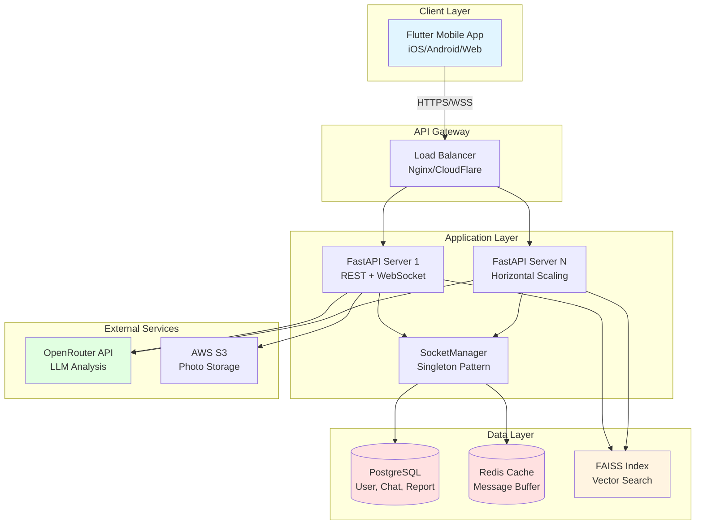
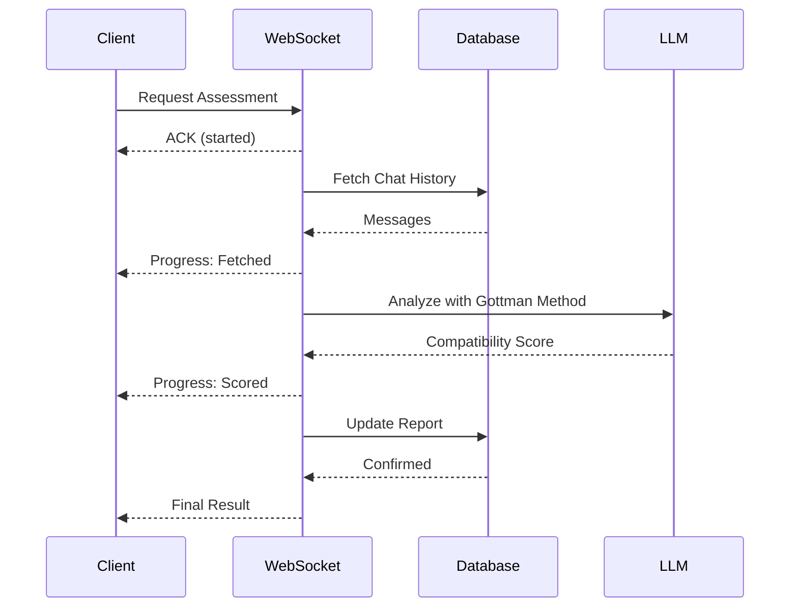

# JanamSaathi AI  


**Finding your life partner using AI — in weeks, not months**  

---

### The Real Problem in Indian Arranged Marriages  
- Parents shortlist → horoscope → family meetings → **1–2 months**  
- Boy & girl finally meet → compatibility check → **another 3–4 months**  
- Dating apps? Fast connection, but shallow ("foodie", "wanderlust") and authenticity issues  

---

## JanamSaathi AI – The AI Matrimony Revolution  

We reduce the entire process from **6+ months → just weeks** using **AI analysis**.  


---


[](https://opensource.org/licenses/MIT)
[](https://fastapi.tiangolo.com)
[](https://flutter.dev)
[](https://www.python.org)

> **Reducing arranged marriage matching from months to weeks using AI-driven compatibility analysis**

---

## 📋 Table of Contents

- [Features](#-features)
- [Preview](#-preview)
- [Architecture](#-architecture)
- [Technology Stack](#-technology-stack)
- [Prerequisites](#-prerequisites)
- [Installation](#-installation)
- [Configuration](#-configuration)
- [Running the Application](#-running-the-application)
- [Project Structure](#-project-structure)
- [API Documentation](#-api-documentation)
- [Key Technical Implementations](#-key-technical-implementations)
- [Future Enhancements](#-future-enhancements)
- [License](#-license)

---

## ✨ Features

### 🔐 **User Management**
- Secure signup/login with JWT authentication (access + refresh tokens)
- Comprehensive profile creation with preferences (cultural practices, lifestyle, family values)
- Photo upload with multipart form-data support
- Token auto-refresh mechanism

### 🤖 **AI-Powered Matchmaking**
- **Semantic similarity search** using FAISS vector database
- **384-dimension embeddings** via SentenceTransformer (`all-MiniLM-L6-v2`)
- Preference-based filtering (gender, religion, caste, lifestyle)
- Real-time top-K recommendations (configurable, default K=5)

### 💬 **Real-Time Chat**
- **WebSocket-based messaging** with sub-100ms latency
- **Optimistic UI updates** (instant local rendering)
- **Redis caching** with bulk DB flush on disconnect (90% reduction in DB writes)
- Automatic reconnection with exponential backoff
- Message deduplication and ordering guarantees

### 📊 **Compatibility Assessment**
- **Gottman Method analysis** - Analyzes 7 relationship principles:
  - Positive vs negative interaction ratio (5:1 healthy threshold)
  - Emotional intimacy indicators
  - Conflict resolution patterns
  - Shared life goals alignment
- **LLM-powered sentiment scoring** via OpenRouter API
- **Incremental averaging** for multi-topic assessments
- **Streaming progress updates** during analysis

### 🌟 **Horoscope Matching**
- Vedic astrology compatibility calculation
- Birth chart analysis (DOB + Place of Birth)
- LLM-based horoscope score generation
- Combined traditional + modern scoring

### 📈 **Reports & Analytics**
- Unified compatibility reports (AI + Horoscope scores)
- Historical assessment tracking
- Deduplication via ordered pair indexing

---
---

## App Preview  

| Screen | Description |  
|--------|-------------|  
|  | **App Splash Screen**|  
|  | **Sign Up Screen** – AI-Based Preference Selection |  
|  | **Feed Screen** – AI-matched profiles |  
|  | **Chat Screen** – Real-time user conversations with AI-powered compatibility analysis |  
|  | **Performing Analysis** – AI driven compatability evaluation |  
|  | **Compatibility Report** – Final match insights |  
## 🏗️ Architecture

### **System Architecture Diagram**


### **Data Flow: Compatibility Assessment**


---

## 🛠️ Technology Stack

### **Frontend**
| Technology | Version | Purpose |
|-----------|---------|---------|
| Flutter | 3.19+ | Cross-platform UI framework |
| Dart | 3.5+ | Programming language |
| WebSocket Channel | 2.4.0 | Real-time communication |
| HTTP | 1.2.1 | REST API calls |
| SharedPreferences | 2.2.2 | Local token storage |
| UUID | 4.5.1 | Request ID correlation |

### **Backend**
| Technology | Version | Purpose |
|-----------|---------|---------|
| FastAPI | 0.115.0 | Async web framework |
| Python | 3.11+ | Programming language |
| PostgreSQL | 14+ | Relational database |
| Redis | 7.0+ | Message cache & pub/sub |
| SQLAlchemy | 2.0.29 | ORM |
| PyJWT | 2.9.0 | Token authentication |

### **AI/ML**
| Technology | Version | Purpose |
|-----------|---------|---------|
| FAISS | 1.7.4 | Vector similarity search |
| SentenceTransformers | 2.6.1 | Text embeddings |
| OpenAI SDK | 1.14.0 | LLM integration (OpenRouter) |
| NumPy | 1.26.4 | Numerical operations |

---

## 📦 Prerequisites

### **System Requirements**

#### **Development Machine**
- **OS:** Windows 10+, macOS 12+, or Ubuntu 20.04+
- **RAM:** Minimum 8GB (16GB recommended)
- **Storage:** 5GB free space

#### **Software**

**Frontend:**
- [Flutter SDK](https://flutter.dev/docs/get-started/install) 3.19 or higher
- [Android Studio](https://developer.android.com/studio) (for Android development)
- [Xcode](https://developer.apple.com/xcode/) (for iOS development, macOS only)

**Backend:**
- [Python](https://www.python.org/downloads/) 3.11 or higher
- [PostgreSQL](https://www.postgresql.org/download/) 14 or higher
- [Redis](https://redis.io/download) 7.0 or higher

**Optional:**
- [Docker](https://docs.docker.com/get-docker/) & Docker Compose (for containerized deployment)
- [Git](https://git-scm.com/downloads) for version control

---

## 🚀 Installation

### **1. Clone the Repository**
```bash
git clone https://github.com/yourusername/janamsaathiai.git
cd janamsaathiai
```

---

### **2. Backend Setup**

#### **Step 2.1: Create Virtual Environment**
```bash
cd backend
python -m venv venv

# Activate virtual environment
# Windows:
venv\Scripts\activate

# macOS/Linux:
source venv/bin/activate
```

#### **Step 2.2: Install Dependencies**
```bash
pip install --upgrade pip
pip install -r requirements.txt
```

#### **Step 2.3: Install & Start PostgreSQL**

**Option A: Native Installation**
```bash
# Ubuntu/Debian
sudo apt update
sudo apt install postgresql postgresql-contrib

# macOS (via Homebrew)
brew install postgresql@14
brew services start postgresql@14

# Windows: Download installer from postgresql.org
```

**Create Database:**
```bash
# Access PostgreSQL
sudo -u postgres psql

# Create database and user
CREATE DATABASE janamsaathiai_db;
CREATE USER janamsaathiai_user WITH PASSWORD 'your_secure_password';
GRANT ALL PRIVILEGES ON DATABASE janamsaathiai_db TO janamsaathiai_user;
\q
```

**Option B: Docker**
```bash
docker run --name janamsaathiai-postgres \
  -e POSTGRES_DB=janamsaathiai_db \
  -e POSTGRES_USER=janamsaathiai_user \
  -e POSTGRES_PASSWORD=your_secure_password \
  -p 5432:5432 \
  -d postgres:14
```

#### **Step 2.4: Install & Start Redis**

**Option A: Native Installation**
```bash
# Ubuntu/Debian
sudo apt install redis-server
sudo systemctl start redis

# macOS
brew install redis
brew services start redis

# Windows: Download from https://github.com/microsoftarchive/redis/releases
```

**Option B: Docker**
```bash
docker run --name janamsaathiai-redis \
  -p 6379:6379 \
  -d redis:7-alpine
```

#### **Step 2.5: Configure Environment Variables**

Create `.env` file in `backend/` directory:
```bash
# Copy template
cp .env.example .env

# Edit with your values
nano .env
```

**`.env` file contents:**
```env
# --- Project Info ---
PROJECT_NAME=janamsaathiai Backend
VERSION=1.0.0
DEBUG=True

# --- Server Configuration ---
BACKEND_HOST=127.0.0.1
BACKEND_PORT=8000

# --- Database ---
DB_USER=janamsaathiai_user
DB_PASS=your_secure_password
DB_HOST=localhost
DB_PORT=5432
DB_NAME=janamsaathiai_db

# --- Redis ---
REDIS_HOST=localhost
REDIS_PORT=6379

# --- Security ---
JWT_SECRET=generate-a-random-secret-key-here-min-32-chars
JWT_ALGORITHM=HS256
ACCESS_EXPIRE_MINUTES=15
REFRESH_EXPIRE_DAYS=30

# --- AI/ML ---
HUGGINGFACE_HUB_TOKEN=your_huggingface_token_here
OPENROUTER_API_KEY=your_openrouter_api_key_here
OPENAI_API_KEY=your_openrouter_api_key_here
LLM_MODEL=anthropic/claude-3.5-sonnet
LLM_BASE_URL=https://openrouter.ai/api/v1

# --- WebSocket ---
WS_PING_INTERVAL=30

# --- Data Directory ---
DATA_DIR=./data
```

**Generate JWT Secret:**
```bash
python -c "import secrets; print(secrets.token_urlsafe(32))"
```

**Get API Keys:**
- **HuggingFace:** https://huggingface.co/settings/tokens
- **OpenRouter:** https://openrouter.ai/keys

#### **Step 2.6: Initialize Database**
```bash
# Run migrations (if using Alembic)
# alembic upgrade head

# Or let SQLAlchemy create tables automatically (development only)
python -c "from core.database import Base, engine; Base.metadata.create_all(bind=engine)"
```

#### **Step 2.7: Create Assets Directory**
```bash
mkdir -p assets/photos
# Add default profile photos to assets/photos/
```

---

### **3. Frontend Setup**
```bash
cd ../frontend  # or cd matchmaking_app

# Get Flutter dependencies
flutter pub get

# Verify Flutter installation
flutter doctor
```

**Configure API Endpoint:**

Edit `lib/services/api.dart`:
```dart
// Update baseUrl for your environment
ApiService({String? overrideBaseUrl, String? overrideBackendHost}) {
  if (overrideBaseUrl != null && overrideBackendHost != null) {
    baseUrl = overrideBaseUrl;
    backendHost = overrideBackendHost;
  } else if (kIsWeb) {
    baseUrl = 'http://127.0.0.1:8000';  // ← Update if different
    backendHost = '127.0.0.1';
  } else if (Platform.isAndroid) {
    baseUrl = 'http://10.0.2.2:8000';  // Android emulator
    backendHost = '10.0.2.2';
  } else {
    baseUrl = 'http://127.0.0.1:8000';
    backendHost = '127.0.0.1';
  }
}
```

---

## ⚙️ Configuration

### **Database Connection Pooling**

Edit `core/database.py`:
```python
engine = create_engine(
    DATABASE_URL,
    echo=settings.DEBUG,
    pool_size=10,        # Adjust based on load
    max_overflow=20,     # Additional connections during spike
    pool_pre_ping=True   # Verify connection before use
)
```

### **WebSocket Ping Interval**

Edit `.env`:
```env
WS_PING_INTERVAL=30  # seconds (default: 30)
```

### **FAISS Index Configuration**

Edit `services/rag_engine.py`:
```python
embedding_dim = 384  # Matches all-MiniLM-L6-v2 model
_faiss_index = faiss.IndexFlatL2(embedding_dim)

# For large datasets (10K+ profiles), use IVF index:
# quantizer = faiss.IndexFlatL2(embedding_dim)
# _faiss_index = faiss.IndexIVFFlat(quantizer, embedding_dim, 100)
```

---

## ▶️ Running the Application

### **Method 1: Manual Start (Development)**

#### **Terminal 1: Start Backend**
```bash
cd backend
source venv/bin/activate  # or venv\Scripts\activate on Windows

# Ensure PostgreSQL and Redis are running
uvicorn main:app --reload --host 0.0.0.0 --port 8000
```

**Expected Output:**
```
INFO:     Uvicorn running on http://0.0.0.0:8000 (Press CTRL+C to quit)
INFO:     Started reloader process [12345] using StatReload
INFO:     Started server process [12346]
INFO:     Waiting for application startup.
INFO:     Application startup complete.
```

**Verify Backend:**
```bash
curl http://localhost:8000/
# Expected: {"message": "Welcome to janamsaathiai Backend"}

# API Documentation:
open http://localhost:8000/docs  # Swagger UI
```

#### **Terminal 2: Start Frontend**
```bash
cd frontend  # or matchmaking_app

# For web:
flutter run -d chrome

# For Android emulator:
flutter run -d <device_id>

# For iOS simulator (macOS only):
flutter run -d <simulator_id>

# List available devices:
flutter devices
```

---

### **Method 2: Docker Compose (Recommended for Production)**

Create `docker-compose.yml` in project root:
```yaml
version: '3.8'

services:
  postgres:
    image: postgres:14-alpine
    container_name: janamsaathiai-db
    environment:
      POSTGRES_DB: janamsaathiai_db
      POSTGRES_USER: janamsaathiai_user
      POSTGRES_PASSWORD: ${DB_PASS}
    ports:
      - "5432:5432"
    volumes:
      - postgres_data:/var/lib/postgresql/data
    healthcheck:
      test: ["CMD-SHELL", "pg_isready -U janamsaathiai_user"]
      interval: 10s
      timeout: 5s
      retries: 5

  redis:
    image: redis:7-alpine
    container_name: janamsaathiai-redis
    ports:
      - "6379:6379"
    volumes:
      - redis_data:/data
    healthcheck:
      test: ["CMD", "redis-cli", "ping"]
      interval: 10s
      timeout: 3s
      retries: 3

  backend:
    build:
      context: ./backend
      dockerfile: Dockerfile
    container_name: janamsaathiai-api
    command: uvicorn main:app --host 0.0.0.0 --port 8000
    ports:
      - "8000:8000"
    environment:
      DB_HOST: postgres
      REDIS_HOST: redis
    env_file:
      - ./backend/.env
    depends_on:
      postgres:
        condition: service_healthy
      redis:
        condition: service_healthy
    volumes:
      - ./backend:/app
      - ./backend/assets:/app/assets

volumes:
  postgres_data:
  redis_data:
```

**Backend Dockerfile** (`backend/Dockerfile`):
```dockerfile
FROM python:3.11-slim

WORKDIR /app

# Install system dependencies
RUN apt-get update && apt-get install -y \
    build-essential \
    libpq-dev \
    && rm -rf /var/lib/apt/lists/*

# Copy requirements and install Python dependencies
COPY requirements.txt .
RUN pip install --no-cache-dir -r requirements.txt

# Copy application code
COPY . .

# Create assets directory
RUN mkdir -p /app/assets/photos

# Expose port
EXPOSE 8000

# Run application
CMD ["uvicorn", "main:app", "--host", "0.0.0.0", "--port", "8000"]
```

**Start all services:**
```bash
docker-compose up -d

# View logs
docker-compose logs -f backend

# Stop all services
docker-compose down
```

---

## 📁 Project Structure
```
janamsaathiai/
│
├── backend/                      # FastAPI Backend
│   ├── core/
│   │   ├── config.py            # Settings (Pydantic)
│   │   ├── database.py          # SQLAlchemy setup
│   │   ├── security.py          # JWT & password hashing
│   │   └── redis.py             # Redis client
│   │
│   ├── models/                   # SQLAlchemy ORM Models
│   │   ├── __init__.py
│   │   ├── user.py              # User table
│   │   ├── chat.py              # ChatMessage table
│   │   └── report.py            # Report table
│   │
│   ├── schemas/                  # Pydantic Schemas
│   │   ├── __init__.py
│   │   ├── user.py              # UserOut, SignupRequest
│   │   ├── chat.py              # FetchConversations
│   │   ├── report.py            # AssessRequest, ReportResponse
│   │   ├── horoscope.py
│   │   └── match.py
│   │
│   ├── routes/                   # API Endpoints
│   │   ├── deps.py              # Dependency injection (get_user_id)
│   │   ├── auth.py              # /auth/signup, /auth/login
│   │   ├── rag_faiss.py         # /recommend (matchmaking)
│   │   ├── conversations.py     # /fetch_conversations
│   │   └── socket_connection.py # /ws (WebSocket)
│   │
│   ├── services/                 # Business Logic
│   │   ├── llm_api.py           # OpenRouter integration
│   │   ├── text_sentiment.py   # Gottman Method analysis
│   │   ├── horoscope.py         # Horoscope calculation
│   │   └── rag_engine.py        # FAISS matching engine
│   │
│   ├── utils/                    # Helper Functions
│   │   ├── helpers.py           # ordered_pair, to_decimal
│   │   ├── profile_utils.py    # CRUD for users
│   │   ├── chat_utils.py        # Chat persistence
│   │   └── report_utils.py      # Report CRUD
│   │
│   ├── ws/                       # WebSocket Handlers
│   │   ├── socket_manager.py   # Singleton manager
│   │   └── handlers/
│   │       ├── chat.py          # Chat message handler
│   │       ├── assess.py        # Assessment handler
│   │       └── report.py        # Report handler
│   │
│   ├── assets/                   # Static files
│   │   └── photos/              # Profile pictures
│   │
│   ├── main.py                   # Application entry point
│   ├── requirements.txt
│   ├── .env.example
│   └── README.md
│
├── frontend/                     # Flutter Frontend
│   ├── lib/
│   │   ├── main.dart            # App entry point
│   │   │
│   │   ├── screens/             # UI Screens
│   │   │   ├── splash_screen.dart
│   │   │   ├── signup_screen.dart
│   │   │   ├── login_page.dart
│   │   │   ├── home_page.dart
│   │   │   ├── profile_detail_page.dart
│   │   │   ├── messages_page.dart
│   │   │   ├── chat_page.dart
│   │   │   └── view_report_page.dart
│   │   │
│   │   └── services/            # API & WebSocket clients
│   │       ├── api.dart         # REST API client
│   │       └── socket/
│   │           ├── socket_manager.dart
│   │           ├── chat_socket.dart
│   │           ├── assess_socket.dart
│   │           ├── report_socket.dart
│   │           └── request_response.dart
│   │
│   ├── assets/
│   │   └── logo.png
│   │
│   ├── pubspec.yaml
│   └── README.md
│
├── .gitignore
├── LICENSE
└── README.md                     # This file
```

---

## 📡 API Documentation

### **Interactive Swagger UI**

Once the backend is running, access:
```
http://localhost:8000/docs
```

### **Key Endpoints**

#### **Authentication**

| Method | Endpoint | Description |
|--------|----------|-------------|
| POST | `/auth/signup` | Create new user account |
| POST | `/auth/login` | Authenticate and get tokens |
| POST | `/auth/refresh` | Refresh access token |
| GET | `/auth/me` | Get current user profile |

#### **Matchmaking**

| Method | Endpoint | Description |
|--------|----------|-------------|
| GET | `/recommend` | Get top 5 recommended matches |

#### **Conversations**

| Method | Endpoint | Description |
|--------|----------|-------------|
| GET | `/fetch_conversations` | Get all user conversations |

#### **WebSocket**

| Endpoint | Protocol | Description |
|----------|----------|-------------|
| `/ws?token=<jwt>` | WebSocket | Real-time messaging & assessments |

**WebSocket Message Types:**
```json
// Chat Message
{
  "type": "chat",
  "request_id": "uuid-v4",
  "payload": {
    "to": "user_id",
    "text": "Hello!",
    "topic": "future_goals"
  }
}

// Assess Compatibility
{
  "type": "assess",
  "request_id": "uuid-v4",
  "payload": {
    "partner_id": "user_id",
    "topic": "lifestyle",
    "messages": [
      {"sender": "alice", "text": "I love cooking"},
      {"sender": "bob", "text": "Me too!"}
    ]
  }
}

// View Report
{
  "type": "view_report",
  "request_id": "uuid-v4",
  "payload": {
    "partner_id": "user_id"
  }
}
```

---

## 🔑 Key Technical Implementations

### **1. Ordered Pair Pattern (Database Deduplication)**

**Problem:** Report for (Alice, Bob) should be same as (Bob, Alice).

**Solution:**
```python
def ordered_pair(user1_id, user2_id):
    return (min(int(user1_id), int(user2_id)), 
            max(int(user1_id), int(user2_id)))

# Always store as (min, max)
u1, u2 = ordered_pair(alice_id, bob_id)
report = Report(user1_id=u1, user2_id=u2, ...)
```

**Database Index:**
```sql
CREATE UNIQUE INDEX ix_report ON report (
    LEAST(user1_id, user2_id),
    GREATEST(user1_id, user2_id)
);
```

**Impact:** Zero duplicate reports, efficient lookups regardless of query order.

---

### **2. Redis Caching with Bulk Flush**

**Flow:**
```python
# During active chat:
await redis_client.rpush(f"chat:{room_id}", json.dumps(message))

# On disconnect:
messages = await redis_client.lrange(f"chat:{room_id}", 0, -1)
await redis_client.delete(f"chat:{room_id}")

# Bulk insert to PostgreSQL
db.bulk_insert_mappings(ChatMessage, messages)
```

**Impact:**
- 90% reduction in DB writes
- Sub-100ms message latency
- Zero message loss on disconnect

---

### **3. Optimistic UI Updates**

**Flutter Implementation:**
```dart
// 1. Show message immediately
setState(() => messages.add({"sender": userId, "text": text}));

// 2. Send to server
final result = await ChatSocket.sendMessageOptimistic(to: partnerId, text: text);

// 3. Handle ack/error
result.ack.then((ack) {
  // Mark as sent ✓
}).catchError((err) {
  // Show retry button
});
```

**Impact:** Instant UI feedback, perceived latency = 0ms.

---

### **4. Incremental Compatibility Averaging**

**Problem:** Assessing multiple topics (lifestyle, future, family) should update running average.

**Solution:**
```python
new_sum = current_sum + new_score
new_count = current_count + 1
new_avg = new_sum / new_count

report.sentiment_sum = new_sum
report.sentiment_count = new_count
report.sentiment_avg = new_avg
```

**Impact:**
- Recalculate average without storing all scores
- Audit trail (sum + count preserved)
- Future: Weighted averaging (recent chats more important)

---

### **5. WebSocket Handler Registry (Extensibility)**

**Pattern:**
```python
# Register handlers
manager.register_handler("chat", handle_chat)
manager.register_handler("assess", handle_assess)
manager.register_handler("view_report", handle_report)

# Dispatch dynamically
handler = _handlers.get(msg_type)
await handler(websocket, user_id, request_id, payload, meta, ctx)
```

**Impact:**
- Add new message types without modifying core logic
- Testable in isolation
- Command pattern implementation
---

## 🚀 Future Enhancements

### **High Priority**

- [ ] **Push Notifications** (FCM for mobile, WebSocket for web)
- [ ] **Read Receipts & Typing Indicators**
- [ ] **Video Chat Integration** (WebRTC)
- [ ] **Advanced Filters** (age range, location radius, education level)
- [ ] **Multi-language Support** (Hindi, Tamil, Telugu, etc.)

### **Medium Priority**

- [ ] **Admin Dashboard** (user management, analytics)
- [ ] **Report Abuse/Block Users**
- [ ] **Photo Verification** (AI-based face matching)
- [ ] **Subscription Plans** (Freemium model)
- [ ] **Email/SMS Notifications**

### **Research & Experimentation**

- [ ] **Graph Neural Networks** for relationship prediction
- [ ] **Reinforcement Learning** for adaptive matching (learn from user feedback)
- [ ] **Voice Message Analysis** (sentiment from tone using speech-to-text + analysis)
- [ ] **Cultural Context Detection** (understand regional nuances, festivals, traditions)
- [ ] **Fine-tuned Compatibility Model** (train on user feedback: "This match was accurate")
- [ ] **Explainable AI** (show *why* two profiles match with specific reasons)

---

## 📄 License

This project is licensed under the MIT License - see the LICENSE file for details.


MIT License

Copyright (c) 2024 [Your Name]

Permission is hereby granted, free of charge, to any person obtaining a copy
of this software and associated documentation files (the "Software"), to deal
in the Software without restriction, including without limitation the rights
to use, copy, modify, merge, publish, distribute, sublicense, and/or sell
copies of the Software, and to permit persons to whom the Software is
furnished to do so, subject to the following conditions:

[Full MIT License text...]


---

## 🙏 Acknowledgments

- Gottman Method - Relationship science foundation   

---

<div align="center">

⭐ Star this repository if you find it useful!  
Report Bug · Request Feature · Documentation  

Made with ❤️ for the arranged marriage community

</div>


---
**Watch Full Demo → [YouTube Video](https://www.youtube.com/watch?v=naVaP0DdNx4)**  

---

#AI #ArtificialIntelligence #Python #Flask #MachineLearning #GenerativeAI #LLM #AIApplications #AIInnovation #AITools #AIDevelopment #HuggingFace #OpenSourceAI #Startup #TechForGood #MatrimonyApp #AppDevelopment #ProductDesign #Innovation
