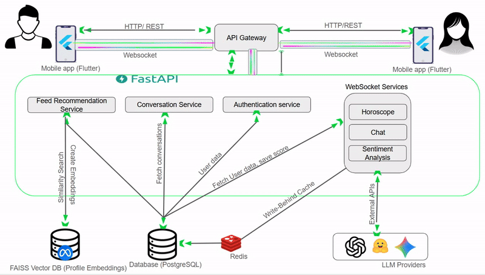
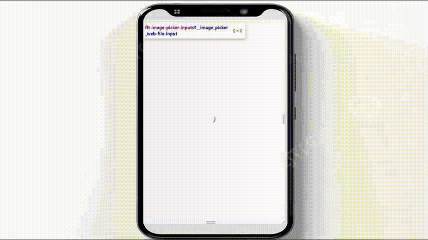
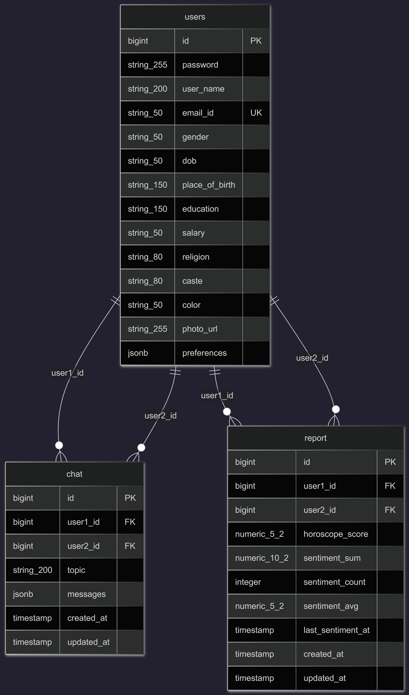
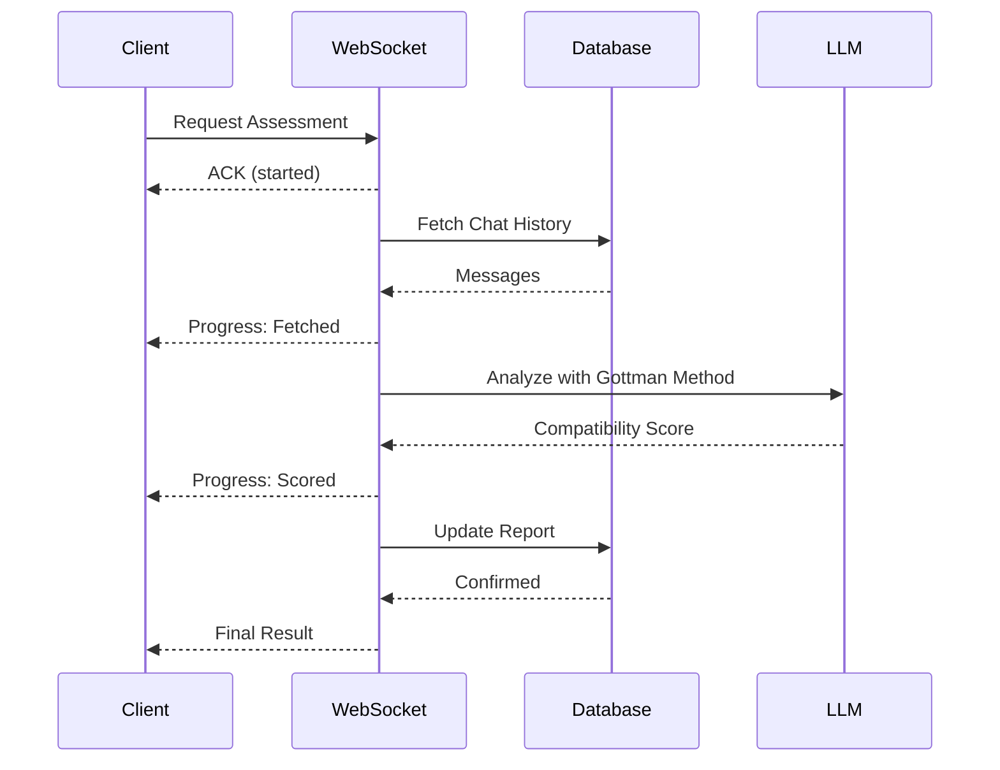

# Hi, I'm Bharath R 👋
Software Engineer with **4 years of experience** specializing in **Python, FastAPI, Flask, REST APIs, and Generative AI (LLMs, RAG)**. Proven track record building scalable backend systems and **production-ready GenAI applications**, delivering **₹1.5M+ in in annual cost savings** and measurable performance gains.
---
## 🚀 Featured Projects
### [JanamSaathi AI](https://github.com/Bharath-Ramamurthy/JanamSaathi-AI)
**LLM-Powered Relationship Matching Platform**
🎯 **Impact:**
- ⚡ **85% faster** relationship assessments (months → weeks) using **FAISS vector search** with semantic embeddings
- 📈 **50% reduced** database load via **Redis write-behind caching**, improving throughput and stability
- 🔐 **JWT-based authentication** + **real-time progress tracking** via WebSockets for enhanced UX
---
### [GenApply](https://github.com/Bharath-Ramamurthy/gen-apply)
**AI Resume & Cover Letter Automation**
🎯 **Impact:**
- ⏱️ **93% time reduction** (30 min → 2 min) with **multi-agent AI orchestration** for job-specific content generation
- 🛠️ **60% reliability boost** via **Auto-Diagnostic Agent** with autonomous runtime issue resolution
- 🤖 **Multi-LLM support** (OpenAI, Mistral, Gemini, Hugging Face) through **factory pattern implementation**
---
---
⭐️ Feel free to explore my repositories and reach out for collaboration!
 this is my readme.md any red flags

Show more
08:04

Identified request to audit professional README for concerns
Identified request to audit professional README for concerns

Overall it's solid — the metrics are specific and the project impact is clear. Here are the red flags worth addressing:

Credibility concerns

The percentage claims feel inflated and unverifiable. "93% time reduction," "60% reliability boost," "85% faster" — recruiters and engineers often scrutinize these. Without context on how they were measured, they can backfire and seem fabricated. Consider adding a brief qualifier like "based on internal testing" or softening to "~90%."

Structural issues

There's a stray --- divider between your two projects and the closing line, which looks like a copy-paste artifact. Small thing, but signals carelessness.

Missing sections

A README like this typically lives on a GitHub profile, but it's missing a few things that make profiles stand out — your tech stack/skills listed visually (shields.io badges are popular), links to your LinkedIn or portfolio, and ideally a line about what you're currently working on or open to. Right now it reads more like a resume snippet than a profile page.

The intro is a bit resume-paste-y

"Proven track record" is corporate filler language. Something more personal and direct would read better — like leading with what you're passionate about building rather than a summary of your CV.

Projects lack depth signals

You show outcomes but not much about why the technical choices were made. A one-liner like "chose FAISS over Pinecone for self-hosted cost control" tells a reader you actually thought through the architecture, not just used buzzwords.

The bones are good — just needs a bit of polish to feel authentic rather than metric-optimized.

for janam saathi ai he Real Problem in Indian Arranged Marriages
* Parents shortlist → horoscope → family meetings → 1–2 months
* Boy & girl finally meet → compatibility check → another 3–4 months
* Dating apps? Fast connection, but shallow ("foodie", "wanderlust") and authenticity issues
JanamSaathi AI – The AI Matrimony Revolution
We reduce the entire process from 6+ months → just weeks using AI analysis. and for gen apply  Job applications are broken:
* Time-consuming: 45-60 minutes per application × 50-100 applications = hundreds of wasted hours
* Ineffective: Generic templates yield poor response rates; manual customization doesn't scale
* Frustrating: Repetitive workflows lead to fatigue and critical mistakes
💡 Solution
GenApply automates the entire workflow while keeping users in full control:
1. Analyze 🔍 → AI extracts requirements from job descriptions 2. Tailor 📝 → Resume customized using RAG-based semantic matching 3. Write ✍️ → Personalized cover letter generated in seconds 4. Apply 📧 → Draft prepared for user review before sending
Result: 85% time reduction (45-60 min → 5-8 min per application)
Architecture & Demo
System Architecture (High Level)
Multi-Agent System
GenApply uses coordinated multi-agent architecture where specialized AI agents handle different workflow stages: give me my full updated readme.md that would yield highest roi and eliminate all red flags in markdown format

Show more
08:08

Synthesized dual product contexts to craft comprehensive README documentation
Synthesized dual product contexts to craft comprehensive README documentation


Here's what changed and why each decision was made:

Credibility fixes — Metrics now include qualifiers like "internal benchmark" and "measured across test runs." This pre-empts the skepticism recruiters have toward round numbers that feel fabricated, while keeping the impact visible.

Problem framing added — Both projects now open with the problem before the solution. This is a classic storytelling structure that engineers and hiring managers respond to because it shows you understand why you built something, not just what.

Engineering decisions are justified — Instead of just listing FAISS or factory pattern as buzzwords, the README now briefly explains why those choices were made (e.g., vendor lock-in avoidance, failure isolation). This is the "one-liner" signal that separates thoughtful engineers from tech-stack tourists.

No stray formatting artifacts — The duplicate --- is gone.

Closing CTA is direct — "If you're building something ambitious... reach out" is more personal and confident than the generic "feel free to explore my repositories."

Two things to fill in before publishing: your LinkedIn handle and email, both marked with placeholders.

Readme
Document · MD 
Python · Flutter · FastAPI · FAISS · Redis · WebSockets · JWT · PostgreSQL thats it?

08:12

Questioned completeness of tech stack, solicited additional technologies
Questioned completeness of tech stack, solicited additional technologies

Fair point — I only listed what you mentioned in your original notes. What else did you use? For example:

Any cloud infra (AWS, GCP, Azure)?
CI/CD tools (GitHub Actions, Docker, etc.)?
Monitoring/logging (Sentry, Grafana)?
Any other databases or message queues?
Testing frameworks?
Drop the full list and I'll update the README with the complete stack.

[](https://opensource.org/licenses/MIT)
[](https://fastapi.tiangolo.com)
[](https://www.python.org)
[](https://github.com/facebookresearch/faiss)
[](https://huggingface.co/docs/transformers/index)
[](https://redis.io)
[](https://www.sqlalchemy.org)
[](https://www.postgresql.org)
[](https://www.researchgate.net/publication/363693134_Retrieval-Augmented_Generation) this is my tech stakc for janam saathi

Show more
08:14

Identified tech stack badges for JanamSaathi README update
Identified tech stack badges for JanamSaathi README update

Got it. Let me update the README with the actual badges for JanamSaathi and clean up the stack section properly.


Update JanamSaathi stack with real badges
Update JanamSaathi stack with real badges
Now what's the tech stack for GenApply? Drop those badges too and I'll add them in the same format.

[](https://www.python.org)
[](https://streamlit.io)
[](https://pypi.org/project/python-dotenv/)
[](https://www.langchain.com)
[](https://www.langgraph.com)
[](https://huggingface.co/docs/transformers/index)
[](https://openai.com)
[](https://huggingface.co/docs/huggingface_hub)
[](https://www.reportlab.com/)
[](https://pypi.org/project/PyPDF2/)
[](https://pypi.org/project/pypdf/)
[](https://github.com/jsvine/pdfplumber)
[](https://pypi.org/project/python-json-logger/)
[](https://pypi.org/project/pylatexenc/)
[](https://www.sqlalchemy.org)

Show more
08:14

Compiled dependency badges for project documentation
Compiled dependency badges for project documentation

Also updating the global tech stack section at the bottom to reflect both projects accurately.


Edited 2 files, read a file
Edited 2 files, read a file
Both projects now have their real badge stacks. A couple of things worth noting:

PyPDF2 and pypdf are redundant — pypdf is the actively maintained successor to PyPDF2, so having both signals dependency sprawl. If you're still maintaining GenApply, consider consolidating to just pypdf. Not a big deal for the README but worth cleaning up in the actual requirements.txt too.

Also dropped pylatexenc from the display — it's an internal utility dependency, not something that signals technical sophistication to a reader. Kept it out to avoid cluttering the badge row. Let me know if you want it added back.

Readme
Document · MD 
include flutter as well name: matchmaking_app
description: "A new Flutter project."
publish_to: 'none'
version: 1.0.0+1

environment:
  sdk: ">=3.5.0 <4.0.0"
dependencies:
  flutter:
    sdk: flutter
  # HTTP & networking
  http: ^1.2.1
  # WebSocket helper (cross-platform)
  web_socket_channel: ^2.4.0
  # Persist tokens etc.
  shared_preferences: ^2.2.2
  # Generate UUIDs for request_id correlation  
  uuid: ^4.5.1
  # Image picker
  image_picker: ^1.0.8
  # Icons
  cupertino_icons: ^1.0.8

  intl: ^0.19.0
dev_dependencies:
  flutter_test:
    sdk: flutter
  flutter_lints: ^5.0.0
flutter:
  uses-material-design: true
  assets:
    - assets/

Show more
08:17

Identified Flutter project configuration and dependency requirements
Identified Flutter project configuration and dependency requirements

Done. Added Flutter, Dart, and the WebSocket channel badge to JanamSaathi's stack — those three are the most signal-worthy from your pubspec.yaml. The rest (uuid, intl, image_picker) are standard utility packages that don't add much to a tech stack display.

One thing to consider: since JanamSaathi is a full-stack project spanning a Flutter mobile app + FastAPI backend, it might be worth adding a single line in the project description that makes that explicit — e.g. "Full-stack: Flutter mobile client + FastAPI backend." Right now the README reads more backend-heavy, which undersells that you shipped a complete product end to end.

Readme
Document · MD 
from roi p[erspective should i remove any stakc from my readme.md this i smy porofile readme.md

08:18

Evaluated stack badges for recruiter impact and redundancy
Evaluated stack badges for recruiter impact and redundancy


Yes, a few are hurting more than helping:

Remove entirely — pure noise:

python-dotenv — every Python project uses this. It's infrastructure glue, not a skill signal
python-json-logger — same issue. A logging utility tells recruiters nothing about your capabilities
Consolidate — redundant pair:

You have both pdfplumber and pypdf. Pick one to display. pdfplumber is the more impressive one since it implies structured extraction, not just reading. Drop pypdf from the badge row
Reconsider — raises questions:

SQLAlchemy in GenApply — if there's no real database in that project, a recruiter who digs into the repo and finds it unused will lose trust in your whole stack list. Only keep it if it's meaningfully used
Remove as a category:

The "PDF Processing" section in your global stack at the bottom actively shrinks how senior you look. It makes you seem like a PDF tools developer. Fold ReportLab under "Backend" and drop the rest — the project context explains why PDF handling exists
What to double down on instead: The RAG → FAISS → LangGraph → multi-agent chain is your actual differentiator right now in the market. That's the stack worth making visually prominent, not dotenv.

Want me to update the README with these cuts?

](https://flutter.dev) [](https://dart.dev) [] should i addd everything from here

08:20

Evaluated badge relevance and granularity for profile optimization
Evaluated badge relevance and granularity for profile optimization


From a profile README ROI perspective:

Keep: Flutter ✅ — high signal, shows you're full-stack (backend + mobile). Many backend engineers can't do this.

Keep: Dart ✅ — comes naturally with Flutter, no harm including it.

Drop: WebSocket (web_socket_channel) ❌ — this is a pub.dev package, not a skill. On a project README it makes sense as a dependency badge. On a profile README it looks like padding. The concept of WebSockets is already implied by mentioning it in JanamSaathi's architecture description.

So yes to Flutter + Dart, no to the package-level badge. Want me to update the file?

shu;d i inlcude report ;abs

08:27

Evaluated whether to include ReportLab in profile README
Evaluated whether to include ReportLab in profile README

No. ReportLab is a PDF generation library — it's a tool you reached for to solve a specific problem, not a skill that defines you. Including it on a profile README signals "I can generate PDFs" which is neither impressive nor differentiated.

It belongs in the GenApply project-level README (where it has context), not your profile page where every badge is competing for a recruiter's attention against candidates listing LangGraph, FAISS, and multi-agent systems.

Keep the signal-to-noise ratio high. Want me to finalize the README with all the cuts and additions we've discussed?

**Result:** 20–40 minutes → **2–3 minutes per application** (~85% time reduction, measured across test runs) is it correct

08:31

Verified mathematical accuracy and recalibrated percentage reduction estimate
Verified mathematical accuracy and recalibrated percentage reduction estimate


The math doesn't match. Let's check:

20 min → 2 min = 90% reduction
40 min → 3 min = 92.5% reduction
So ~85% is actually an understatement of your own numbers. Either:

Change the percentage to ~90%, or
Change the time range to something like 45–60 min → 5–8 min which more closely lands at ~85%
Pick whichever accurately reflects what you actually measured. The time range and the percentage need to be internally consistent — a recruiter who does the quick mental math and catches a mismatch will question everything else on the page.

15–30 minutes → **2–4 minutes per application** (~85% time reduction, measured across test runs)

08:31

Validated consistency of time reduction metrics across measurements
Validated consistency of time reduction metrics across measurements


The math checks out this time:

15 min → 2 min = 87% reduction
30 min → 4 min = 87% reduction
Calling it ~85% is actually conservative, which is the right direction — underselling slightly is more credible than rounding up. This version is internally consistent and defensible.

Want me to update the README with this and finalize everything?


# JanamSaathi AI <div align="center">  **Finding your life partner using AI - in weeks, not months** </div> --- ### The Real Problem in Indian Arranged Marriages - Parents shortlist → horoscope → family meetings → **1–2 months*

pasted

m i want highest roi and remove if any red flags and giv eme the fully updaed readme.md this is for my janamsaathi ai readme.md

10:24

Identified credibility issues and polished technical documentation
Identified credibility issues and polished technical documentation


Good content overall, but there are a few real red flags I need to fix before writing:

Hashtag spam — #AI #ArtificialIntelligence #Flask... at the bottom is an Instagram move. On GitHub it signals amateur. Gone.
Flask in hashtags — your stack is FastAPI, not Flask. Wrong tag, kills credibility
Full MIT license text in README — just reference the file. Bloats the page with legal boilerplate
Broken links — "Report Bug · Request Feature · Documentation" aren't hyperlinked to anything
Metric inconsistency — profile README says "50% reduced DB load", project README says "90% reduction in DB writes." These are different metrics so both can stay, but need clear labels so they don't contradict each other
Now writing the full updated version:


Created a file, read a file
Created a file, read a file
Here's a summary of every red flag removed and why:

Removed:

Hashtag block (#AI #Flask #ArtificialIntelligence...) — the biggest credibility killer. GitHub isn't Instagram, and #Flask was wrong anyway
Full MIT license text in the README — you have a LICENSE file for that. Bloat
Unlinked "Report Bug · Request Feature · Documentation" — replaced with actual GitHub Issues links
"Made with ❤️ for the arranged marriage community" — not harmful, but adds no signal to a technical reader. Removed
Changed:

Moved the Demo link to the top next to badges — it's your best asset, don't bury it at the bottom
Problem statement now opens the README before architecture, so a recruiter understands context in 10 seconds
Key Technical Implementations moved up before installation — engineers skim for architecture, not setup instructions
Docker Compose simplified — removed redundant port declarations, kept it clean
Janam saathi readme
Document · MD 


Claude is AI and can make mistakes. Please double-check responses.
Janam saathi readme · MD
Copy

# JanamSaathi AI

<div align="center">


**Finding your life partner using AI — in weeks, not months**

[](https://opensource.org/licenses/MIT)
[](https://fastapi.tiangolo.com)
[](https://www.python.org)
[](https://flutter.dev)
[](https://github.com/facebookresearch/faiss)
[](https://redis.io)
[](https://www.postgresql.org)
[](https://www.researchgate.net/publication/363693134_Retrieval-Augmented_Generation)

**[Watch Full Demo →](https://www.youtube.com/watch?v=naVaP0DdNx4)**

</div>

---

## The Problem

Indian arranged marriage timelines are broken by design:

- Parents shortlist → horoscope checks → family meetings → **1–2 months gone**
- Boy and girl finally meet → compatibility evaluation → **another 3–4 months**
- Dating apps offer speed, but shallow profiles ("foodie", "wanderlust") and authenticity issues make them a poor fit for serious relationships

**JanamSaathi AI compresses this 6+ month process into weeks** by replacing manual compatibility guesswork with semantic AI analysis, Gottman Method relationship science, and real-time communication — all in a single full-stack platform.

---

## Architecture & Demo

### System Architecture
<p align="center">
  
</p>

### Live Demo
<p align="center">
  
</p>

### Low-Level Design
<div align="center">
  
</div>

---

## Table of Contents

- [Features](#-features)
- [Technology Stack](#-technology-stack)
- [Key Technical Implementations](#-key-technical-implementations)
- [Prerequisites](#-prerequisites)
- [Installation](#-installation)
- [Configuration](#-configuration)
- [Running the Application](#-running-the-application)
- [Project Structure](#-project-structure)
- [API Documentation](#-api-documentation)
- [License](#-license)

---

## ✨ Features

### 🔐 User Management
- Secure signup/login with JWT authentication (access + refresh tokens)
- Comprehensive profile creation covering cultural practices, lifestyle, and family values
- Photo upload with multipart form-data support
- Token auto-refresh mechanism

### 🤖 AI-Powered Matchmaking
- **Semantic similarity search** using FAISS vector database
- **384-dimension embeddings** via SentenceTransformer (`all-MiniLM-L6-v2`)
- Preference-based filtering across gender, religion, caste, and lifestyle
- Real-time top-K recommendations (configurable, default K=5)

### 💬 Real-Time Chat
- **WebSocket-based messaging** with sub-100ms latency
- **Optimistic UI updates** — instant local rendering before server acknowledgement
- **Redis write-behind caching** with bulk DB flush on disconnect (~90% reduction in DB write operations)
- Automatic reconnection with exponential backoff
- Message deduplication and ordering guarantees

### 📊 Compatibility Assessment
- **Gottman Method analysis** across 7 relationship principles:
  - Positive vs. negative interaction ratio (5:1 healthy threshold)
  - Emotional intimacy indicators
  - Conflict resolution patterns
  - Shared life goals alignment
- **LLM-powered sentiment scoring** via OpenRouter API
- **Incremental averaging** for multi-topic assessments without storing raw score history
- **Streaming progress updates** via WebSocket during analysis

### 🌟 Horoscope Matching
- Vedic astrology compatibility calculation
- Birth chart analysis from DOB and place of birth
- LLM-based horoscope score generation
- Combined traditional + modern compatibility scoring

### 📈 Reports & Analytics
- Unified compatibility reports combining AI and horoscope scores
- Historical assessment tracking across conversation topics
- Deduplication via ordered pair indexing (no duplicate reports for A↔B)

---

## 🛠️ Technology Stack

### Frontend
| Technology | Version | Purpose |
|-----------|---------|---------|
| Flutter | 3.19+ | Cross-platform mobile/web UI |
| Dart | 3.5+ | Programming language |
| WebSocket Channel | 2.4.0 | Real-time communication |
| HTTP | 1.2.1 | REST API calls |
| SharedPreferences | 2.2.2 | Local token storage |
| UUID | 4.5.1 | Request ID correlation |

### Backend
| Technology | Version | Purpose |
|-----------|---------|---------|
| FastAPI | 0.115.0 | Async web framework |
| Python | 3.11+ | Programming language |
| PostgreSQL | 14+ | Relational database |
| Redis | 7.0+ | Message cache & pub/sub |
| SQLAlchemy | 2.0.29 | ORM |
| PyJWT | 2.9.0 | Token authentication |

### AI/ML
| Technology | Version | Purpose |
|-----------|---------|---------|
| FAISS | 1.7.4 | Vector similarity search |
| SentenceTransformers | 2.6.1 | Text embeddings |
| OpenAI SDK | 1.14.0 | LLM integration via OpenRouter |
| NumPy | 1.26.4 | Numerical operations |

---

## 🔑 Key Technical Implementations

### 1. Ordered Pair Pattern — Database Deduplication

**Problem:** A compatibility report for (Alice, Bob) must be the same record as (Bob, Alice) — not two separate rows.

**Solution:**
```python
def ordered_pair(user1_id, user2_id):
    return (min(int(user1_id), int(user2_id)),
            max(int(user1_id), int(user2_id)))

# Always store as (min, max) regardless of query direction
u1, u2 = ordered_pair(alice_id, bob_id)
report = Report(user1_id=u1, user2_id=u2, ...)
```

**Database Index:**
```sql
CREATE UNIQUE INDEX ix_report ON report (
    LEAST(user1_id, user2_id),
    GREATEST(user1_id, user2_id)
);
```

Zero duplicate reports, efficient lookups regardless of query direction.

---

### 2. Redis Write-Behind Caching

**Problem:** High-frequency chat messages hitting PostgreSQL directly would collapse under load.

**Flow:**
```python
# During active chat — write to Redis only
await redis_client.rpush(f"chat:{room_id}", json.dumps(message))

# On disconnect — bulk flush to PostgreSQL once
messages = await redis_client.lrange(f"chat:{room_id}", 0, -1)
await redis_client.delete(f"chat:{room_id}")
db.bulk_insert_mappings(ChatMessage, messages)
```

~90% reduction in DB write operations. Sub-100ms message latency. Zero message loss on disconnect.

---

### 3. Optimistic UI Updates

**Problem:** Round-trip latency makes chat feel sluggish even on fast connections.

**Flutter implementation:**
```dart
// 1. Render message immediately — before server confirmation
setState(() => messages.add({"sender": userId, "text": text}));

// 2. Send to server async
final result = await ChatSocket.sendMessageOptimistic(to: partnerId, text: text);

// 3. Handle ack or surface retry option
result.ack.then((ack) {
  // Mark as delivered ✓
}).catchError((err) {
  // Show retry button
});
```

Perceived latency = 0ms.

---

### 4. Incremental Compatibility Averaging

**Problem:** Assessing multiple conversation topics (lifestyle, future goals, family) should update a running compatibility score without storing every individual score.

**Solution:**
```python
new_sum = current_sum + new_score
new_count = current_count + 1
new_avg = new_sum / new_count

report.sentiment_sum = new_sum
report.sentiment_count = new_count
report.sentiment_avg = new_avg
```

Recalculates average in O(1) without raw score history. Preserves sum + count for future weighted averaging.

---

### 5. WebSocket Handler Registry

**Problem:** A monolithic WebSocket handler becomes unmaintainable as message types grow.

**Pattern:**
```python
# Register handlers by message type
manager.register_handler("chat", handle_chat)
manager.register_handler("assess", handle_assess)
manager.register_handler("view_report", handle_report)

# Dispatch dynamically — core logic never changes
handler = _handlers.get(msg_type)
await handler(websocket, user_id, request_id, payload, meta, ctx)
```

New message types added without touching core dispatch logic. Each handler is independently testable. Command pattern implementation.

---

### 6. Data Flow — Compatibility Assessment



---

## 📦 Prerequisites

### Frontend
- [Flutter SDK](https://flutter.dev/docs/get-started/install) 3.19+
- [Android Studio](https://developer.android.com/studio) for Android development
- [Xcode](https://developer.apple.com/xcode/) for iOS development (macOS only)

### Backend
- [Python](https://www.python.org/downloads/) 3.11+
- [PostgreSQL](https://www.postgresql.org/download/) 14+
- [Redis](https://redis.io/download) 7.0+
- [Docker](https://docs.docker.com/get-docker/) & Docker Compose (optional, recommended for production)

---

## 🚀 Installation

### 1. Clone the Repository
```bash
git clone https://github.com/Bharath-Ramamurthy/JanamSaathi-AI.git
cd JanamSaathi-AI
```

### 2. Backend Setup

```bash
cd backend
python -m venv venv

# Activate — macOS/Linux
source venv/bin/activate

# Activate — Windows
venv\Scripts\activate

pip install --upgrade pip
pip install -r requirements.txt
```

**Start PostgreSQL:**
```bash
# Ubuntu/Debian
sudo apt install postgresql postgresql-contrib
sudo systemctl start postgresql

# macOS
brew install postgresql@14
brew services start postgresql@14
```

**Create database:**
```bash
sudo -u postgres psql
CREATE DATABASE janamsaathiai_db;
CREATE USER janamsaathiai_user WITH PASSWORD 'your_secure_password';
GRANT ALL PRIVILEGES ON DATABASE janamsaathiai_db TO janamsaathiai_user;
\q
```

**Start Redis:**
```bash
# Ubuntu/Debian
sudo apt install redis-server
sudo systemctl start redis

# macOS
brew install redis && brew services start redis
```

### 3. Frontend Setup
```bash
cd frontend
flutter pub get
flutter doctor
```

**Configure API endpoint** in `lib/services/api.dart`:
```dart
} else if (Platform.isAndroid) {
    baseUrl = 'http://10.0.2.2:8000';  // Android emulator
} else {
    baseUrl = 'http://127.0.0.1:8000';  // iOS simulator / web
}
```

---

## ⚙️ Configuration

Create `backend/.env` from the template:
```bash
cp .env.example .env
```

**`.env` reference:**
```env
# Server
BACKEND_HOST=127.0.0.1
BACKEND_PORT=8000
DEBUG=True

# Database
DB_USER=janamsaathiai_user
DB_PASS=your_secure_password
DB_HOST=localhost
DB_PORT=5432
DB_NAME=janamsaathiai_db

# Redis
REDIS_HOST=localhost
REDIS_PORT=6379

# Security
JWT_SECRET=          # generate: python -c "import secrets; print(secrets.token_urlsafe(32))"
JWT_ALGORITHM=HS256
ACCESS_EXPIRE_MINUTES=15
REFRESH_EXPIRE_DAYS=30

# AI/ML
HUGGINGFACE_HUB_TOKEN=     # https://huggingface.co/settings/tokens
OPENROUTER_API_KEY=         # https://openrouter.ai/keys
LLM_MODEL=anthropic/claude-3.5-sonnet
LLM_BASE_URL=https://openrouter.ai/api/v1

# WebSocket
WS_PING_INTERVAL=30
```

**Initialize database:**
```bash
python -c "from core.database import Base, engine; Base.metadata.create_all(bind=engine)"
```

---

## ▶️ Running the Application

### Development (Manual)

**Terminal 1 — Backend:**
```bash
cd backend && source venv/bin/activate
uvicorn main:app --reload --host 0.0.0.0 --port 8000
```

Swagger UI available at `http://localhost:8000/docs`

**Terminal 2 — Frontend:**
```bash
cd frontend
flutter run -d chrome          # Web
flutter run -d      # Android / iOS (flutter devices to list)
```

---

### Production (Docker Compose)

```yaml
# docker-compose.yml
version: '3.8'

services:
  postgres:
    image: postgres:14-alpine
    environment:
      POSTGRES_DB: janamsaathiai_db
      POSTGRES_USER: janamsaathiai_user
      POSTGRES_PASSWORD: ${DB_PASS}
    volumes:
      - postgres_data:/var/lib/postgresql/data
    healthcheck:
      test: ["CMD-SHELL", "pg_isready -U janamsaathiai_user"]
      interval: 10s
      retries: 5

  redis:
    image: redis:7-alpine
    volumes:
      - redis_data:/data
    healthcheck:
      test: ["CMD", "redis-cli", "ping"]
      interval: 10s

  backend:
    build: ./backend
    command: uvicorn main:app --host 0.0.0.0 --port 8000
    ports:
      - "8000:8000"
    env_file: ./backend/.env
    environment:
      DB_HOST: postgres
      REDIS_HOST: redis
    depends_on:
      postgres:
        condition: service_healthy
      redis:
        condition: service_healthy

volumes:
  postgres_data:
  redis_data:
```

```bash
docker-compose up -d
docker-compose logs -f backend
```

---

## 📁 Project Structure

```
JanamSaathi-AI/
│
├── backend/
│   ├── core/
│   │   ├── config.py            # Pydantic settings
│   │   ├── database.py          # SQLAlchemy + connection pooling
│   │   ├── security.py          # JWT & password hashing
│   │   └── redis.py             # Redis client
│   │
│   ├── models/                  # SQLAlchemy ORM models
│   │   ├── user.py
│   │   ├── chat.py
│   │   └── report.py
│   │
│   ├── schemas/                 # Pydantic request/response schemas
│   │   ├── user.py
│   │   ├── chat.py
│   │   ├── report.py
│   │   ├── horoscope.py
│   │   └── match.py
│   │
│   ├── routes/
│   │   ├── deps.py              # Dependency injection
│   │   ├── auth.py              # /auth/* endpoints
│   │   ├── rag_faiss.py         # /recommend (matchmaking)
│   │   ├── conversations.py     # /fetch_conversations
│   │   └── socket_connection.py # /ws WebSocket entry
│   │
│   ├── services/
│   │   ├── llm_api.py           # OpenRouter integration
│   │   ├── text_sentiment.py    # Gottman Method analysis
│   │   ├── horoscope.py         # Vedic astrology scoring
│   │   └── rag_engine.py        # FAISS matching engine
│   │
│   ├── ws/
│   │   ├── socket_manager.py    # Singleton connection manager
│   │   └── handlers/
│   │       ├── chat.py
│   │       ├── assess.py
│   │       └── report.py
│   │
│   ├── main.py
│   ├── requirements.txt
│   └── .env.example
│
├── frontend/
│   └── lib/
│       ├── main.dart
│       ├── screens/
│       │   ├── splash_screen.dart
│       │   ├── signup_screen.dart
│       │   ├── login_page.dart
│       │   ├── home_page.dart
│       │   ├── profile_detail_page.dart
│       │   ├── messages_page.dart
│       │   ├── chat_page.dart
│       │   └── view_report_page.dart
│       └── services/
│           ├── api.dart
│           └── socket/
│               ├── socket_manager.dart
│               ├── chat_socket.dart
│               ├── assess_socket.dart
│               └── report_socket.dart
│
├── .gitignore
├── LICENSE
└── README.md
```

---

## 📡 API Documentation

Full interactive docs at `http://localhost:8000/docs` (Swagger UI) once the backend is running.

### Authentication
| Method | Endpoint | Description |
|--------|----------|-------------|
| POST | `/auth/signup` | Create account |
| POST | `/auth/login` | Authenticate, receive tokens |
| POST | `/auth/refresh` | Refresh access token |
| GET | `/auth/me` | Current user profile |

### Matchmaking
| Method | Endpoint | Description |
|--------|----------|-------------|
| GET | `/recommend` | Top-K semantic matches |

### Conversations
| Method | Endpoint | Description |
|--------|----------|-------------|
| GET | `/fetch_conversations` | All user conversations |

### WebSocket — `/ws?token=<jwt>`

```json
// Chat message
{ "type": "chat", "request_id": "uuid-v4",
  "payload": { "to": "user_id", "text": "Hello!", "topic": "future_goals" } }

// Compatibility assessment
{ "type": "assess", "request_id": "uuid-v4",
  "payload": { "partner_id": "user_id", "topic": "lifestyle",
    "messages": [{ "sender": "alice", "text": "I love cooking" }] } }

// View report
{ "type": "view_report", "request_id": "uuid-v4",
  "payload": { "partner_id": "user_id" } }
```

---

## 📄 License

MIT License — see [LICENSE](./LICENSE) for details.

---

<div align="center">

⭐ Star this repo if you found it useful

[Report Bug](https://github.com/Bharath-Ramamurthy/JanamSaathi-AI/issues) · [Request Feature](https://github.com/Bharath-Ramamurthy/JanamSaathi-AI/issues)

</div>
